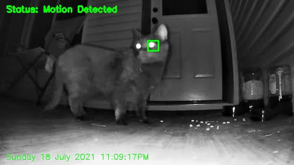
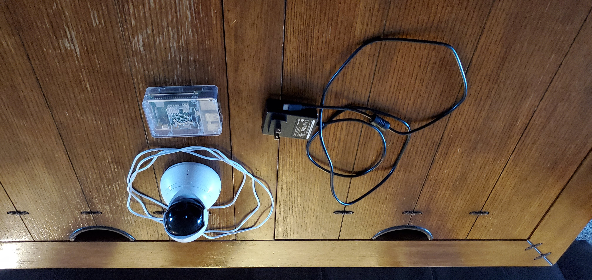

<h1 align="center"><b>OpenCV Home Security</b></h1>

  
Read IP Camera Stream and detect motion.

<!-- ABOUT THE PROJECT -->
## About The Project

This Python script reads the video coming from a home IP camera. When motion is detected, the object is tracked and written to an .AVI video file. The video file is then emailed to the recipient. BONUS: if you email the subject 'SEE' to the Rpi; it'll record 10 seconds of video and email it to the recipient.

## What Problem does this solve?
I hadn't seen my cat in over a month, but <i>something</i> was still consuming the cat food. This system proved to me that he just shows up in the middle of the night.

### Built With
<ul>
<li>Software: Python, OpenCV</li>
<li>Hardware: Raspberry Pi 3B, Yi Dome Camera</li>
  </ul>

